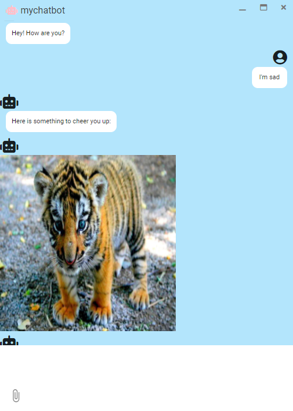

# rasa chatbotroom UI

## 1. How to run server?

- Rasa

```
rasa run -m models --enable-api --cors "*"
```

- Rasa custom action

```
resa run actions
```

- electron

```
npm run electron:serve
```

## 2. Preview UI


